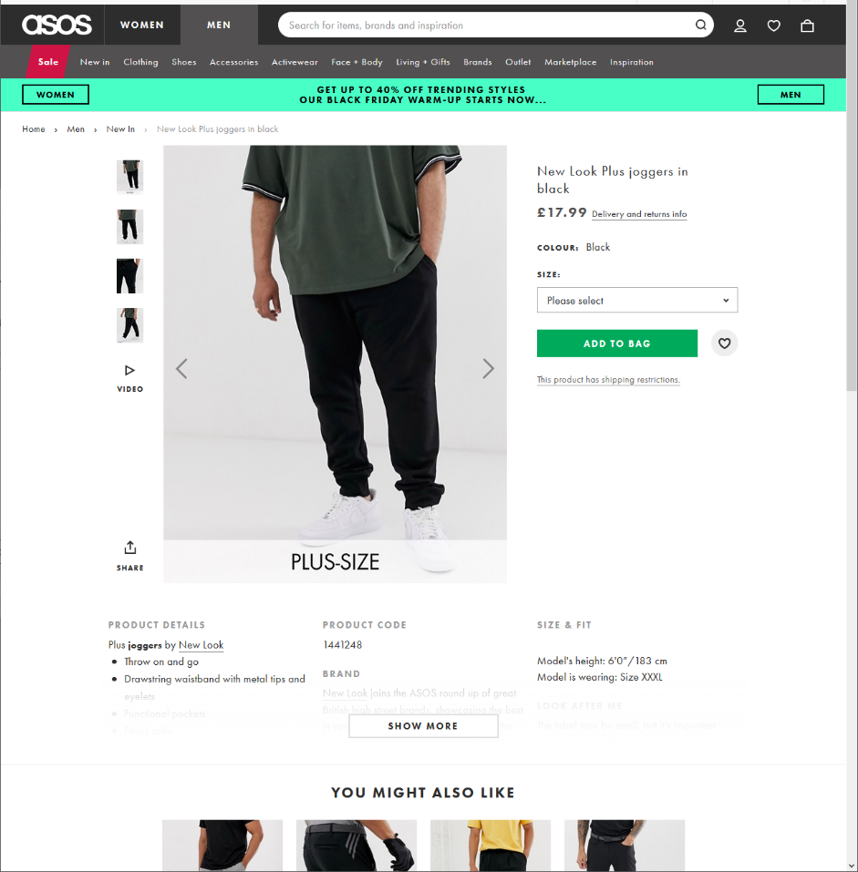

# ASOS-Product-and-Price-Comparison-to-H-and-M
Through webscraping both ASOS and H&amp;M clothing retailers I have completed a Product and Price comparison tool

<h3 class="panel-title">ASOS product comparison to H&M </h3>

<table border=1 class="table table-striped table-bordered table-hover table-condensed">
<thead><tr><th title="Field #1">ASOS_Name</th>
<th title="Field #2">ASOS_Price (£)</th>
<th title="Field #3">ASOS_URL_Link</th>
<th title="Field #4">HnM_Name</th>
<th title="Field #5">HnM_Price (£)</th>
<th title="Field #6">HnM_Color</th>
<th title="Field #7">HnM_Category</th>
<th title="Field #8">HnM_URL_Link</th>
</tr></thead>
<tbody><tr><td>New Look Plus joggers in black</td>
<td align="right">17.99</td>
<td>https://www.asos.com/new-look/new-look-plus-joggers-in-black/prd/11841379?clr=black&amp;colourWayId=16421347&amp;SearchQuery=&amp;cid=27110</td>
<td>Joggers</td>
<td align="right">19.99</td>
<td>Black</td>
<td>men_trousers_joggers</td>
<td>https://www2.hm.com/en_gb/productpage.0698950001.html</td>
</tr>
<tr><td>ASOS DESIGN Plus slim smart trousers in navy</td>
<td align="right">20.00</td>
<td>https://www.asos.com/asos-design/asos-design-plus-slim-smart-trousers-in-navy/prd/11464604?clr=navy&amp;colourWayId=16377386&amp;SearchQuery=&amp;cid=27110</td>
<td>Suit trousers Slim Fit</td>
<td align="right">24.99</td>
<td>Dark blue</td>
<td>men_trousers_trousers_skinny_all</td>
<td>https://www2.hm.com/en_gb/productpage.0716115001.html</td>
</tr>
<tr><td>Pier One slipper loafers in brown suede</td>
<td align="right">36.00</td>
<td>https://www.asos.com/pier-one/pier-one-slipper-loafers-in-brown-suede/prd/11766716?clr=brown&amp;colourWayId=16334548&amp;SearchQuery=&amp;cid=27110</td>
<td>Loafers</td>
<td align="right">49.99</td>
<td>Mole</td>
<td>men_shoes_dressed</td>
<td>https://www2.hm.com/en_gb/productpage.0642687002.html</td>
</tr>
</tbody></table>

<figure class="half" style="display:flex">
    
    
    <figcaption>Caption describing these two images.</figcaption>
</figure>

<section>
    
    
</section>
                                                   

